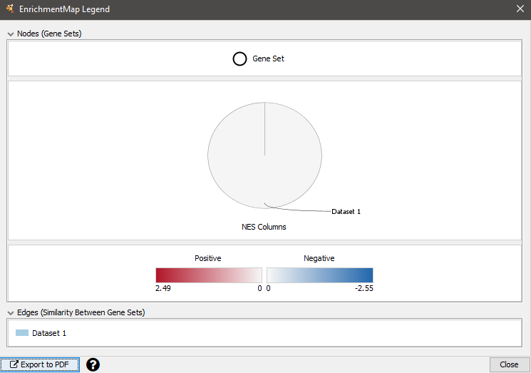
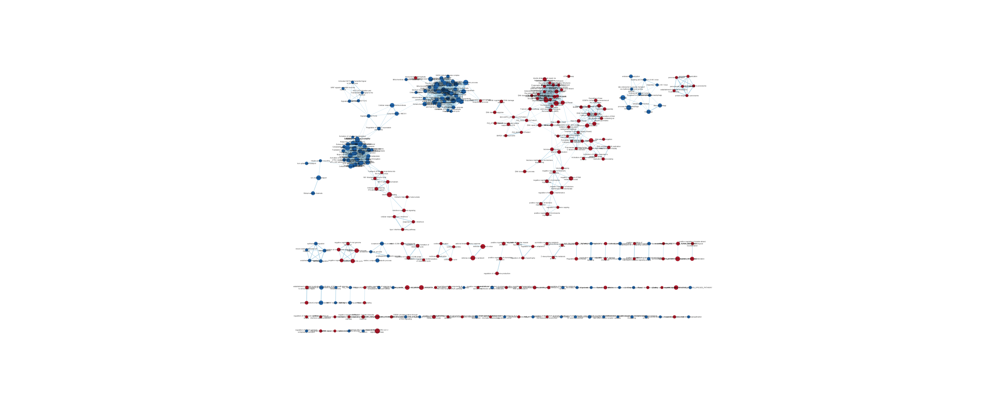
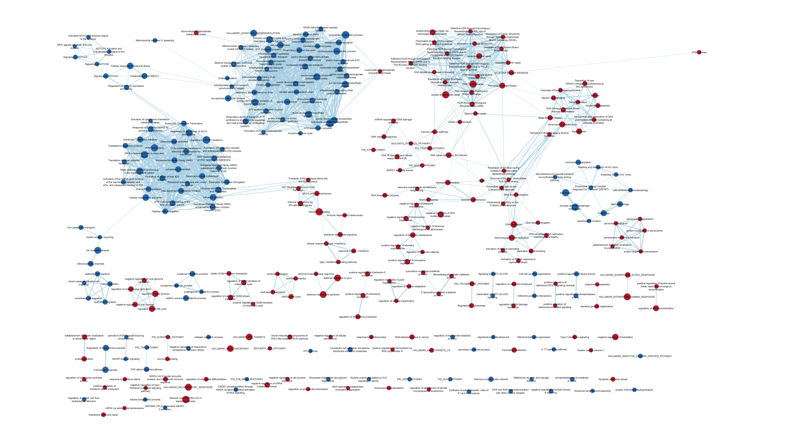

I'm using the same dataset from prior assignments, ["Differential effect of SARS-CoV-2 spike glycoprotein 1 on human bronchial and alveolar lung mucosa models: Implications on pathogenicity."](https://www.ncbi.nlm.nih.gov/geo/query/acc.cgi?acc=GSE185657),
published December 13, 2021. The corresponding publication can be found on GEO and in the [references](#references).

This experiment compares the expression response of human alveolar and bronchial
cells to SARS-CoV-2 spike protein through RNA sequencing. Figure 1 from the paper
shows the experimental design.


```{r, include=FALSE}
# From A1
library(GEOmetadb)
library(GEOquery)
# Download the metadata GEO series, or load from disk if already downloaded
if (!file.exists("GSE185657.rds")) {
  gse <- getGEO("GSE185657")
  saveRDS(gse, "GSE185657.rds")
} else {
  gse <- readRDS("GSE185657.rds") 
}
# Download supplementary tarball
if (!file.exists("GSE185657_RAW.tar")) {
  files <- getGEOSuppFiles("GSE185657", makeDirectory=FALSE)
  target <- rownames(files[1])
} else{
  target <- "./GSE185657_RAW.tar"
}
contents <- untar(target, list=TRUE)
if (!file.exists("GSE185657_normalized_CPM.rds")) {
  # Remove all extracted files to reperform the extraction and decompression
  if (!file.exists("GSM5621226_A_C1.txt")) {
    untar(target)
    lapply(contents, gunzip)
  }
  # Construct the raw counts matrix
  targets <- gsub(".gz$", "", contents)
  raw_list <- lapply(targets, read.delim)
  genes <- raw_list[[1]]$Ensembl_gene_ID
  samples <- sapply(raw_list, function (sample) colnames(sample)[2])
  counts <- sapply(raw_list, function(sample) sample[[2]])
  rownames(counts) <- genes
  colnames(counts) <- samples
  saveRDS(counts, "GSE185657_raw_CPM.rds")
  # Map to HUGO gene symbols
  GRCh38 <- biomaRt::useEnsembl("genes", "hsapiens_gene_ensembl")
  ensg2hgnc <- biomaRt::getBM(c("ensembl_gene_id", "hgnc_symbol"), mart=GRCh38)
  gene_symbols <- ensg2hgnc$hgnc_symbol[match(genes, ensg2hgnc$ensembl_gene_id)]
  saveRDS(gene_symbols, "GSE185657_raw_symbols.rds")
  # Clean data based on read threshold
  filtered_counts <- counts[rowSums(counts > 1) >= 6, ]
  filtered_symbols <- ensg2hgnc$hgnc_symbol[match(rownames(filtered_counts), ensg2hgnc$ensembl_gene_id)]
  saveRDS(filtered_counts, "GSE185657_filtered_CPM.rds")
  saveRDS(filtered_symbols, "GSE185657_filtered_symbols.rds")
  # Apply TMM normalization to cleaned CPMs
  groups <- gsub("\\d", "", colnames(filtered_counts))
  d <- edgeR::DGEList(filtered_counts, group = groups)
  d <- edgeR::calcNormFactors(d)
  normalized_counts <- edgeR::cpm(d)
  saveRDS(normalized_counts, "GSE185657_normalized_CPM.rds")
} else {
  counts <- readRDS("GSE185657_raw_CPM.rds")
  gene_symbols <- readRDS("GSE185657_raw_symbols.rds")
  filtered_counts <- readRDS("GSE185657_filtered_CPM.rds")
  filtered_symbols <- readRDS("GSE185657_filtered_symbols.rds")
  normalized_counts <- readRDS("GSE185657_normalized_CPM.rds")
}

# From A2
design <- data.frame(lapply(colnames(normalized_counts), function(x) {
  gsub("\\d", "", unlist(strsplit(x, "_")))
}))
colnames(design) <- colnames(normalized_counts)
rownames(design) <- c("cell_type", "exposure")
design <- data.frame(t(design))

design_model <- model.matrix(~ design$cell_type + design$exposure)
minimal_set <- ExpressionSet(normalized_counts)
fit <- limma::lmFit(minimal_set, design_model)
fit2 <- limma::eBayes(fit, trend=TRUE)
topfit <- limma::topTable(fit2, coef=ncol(design_model), adjust.method="BH", number=nrow(normalized_counts))
# Add the gene symbols
output_hits <- merge(
  data.frame(gene = filtered_symbols, row.names = rownames(normalized_counts)),
  topfit,
  by=0,
  all=TRUE
)
# Sort by unadjusted p-value
output_hits <- output_hits[order(output_hits$P.Value),]
```

## Non-thresholded Gene set Enrichment Analysis

I will be using GSEA 4.1.0 from Docker image `risserlin/em_base_image:version_with_bioc_3_13`
per lectures and a prior homework. I will be using the current April release of a
geneset from the Gary Bader lab for enrichment analysis, containing GO biological
processes and pathways but no IEA,
[`Human_GOBP_AllPathways_no_GO_iea_April_01_2022_symbol.gmt`](https://download.baderlab.org/EM_Genesets/current_release/Human/symbol/Human_GOBP_AllPathways_no_GO_iea_April_01_2022_symbol.gmt)

This geneset uses HGNC symbols, so construct the ranked list for GSEA accordingly.

```{r}
rnk <- output_hits[output_hits$gene != "" & !is.na(output_hits$gene),]
rnk$rank <- -log10(rnk$P.Value) * sign(rnk$logFC)
# See https://software.broadinstitute.org/cancer/software/gsea/wiki/index.php/Data_formats#Ranked_Gene_Lists
write.table(rnk[,c("gene", "rank")], "GSEA_GSE185657.rnk", sep="\t", quote=FALSE, row.names=FALSE, col.names=FALSE)
```

The following commands were run in a shell due to instabilility with RStudio in
the Docker image used. The parameters match that used in lectures and the prior
homework.

```console
host$ docker run --rm -it --user=rstudio -v $(pwd):/home/rstudio/projects risserlin/em_base_image:version_with_bioc_3_13 bash
rstudio@container$ cd ~/GSEA_4.1.0
rstudio@container$ ./gsea-cli.sh GSEAPreRanked -gmx ../projects/Human_GOBP_AllPathways_no_GO_iea_April_01_2022_symbol.gmt -rnk ../projects/GSEA_GSE185657.rnk -collapse false -nperm 1000 -scoring_scheme weighted -rpt_label A3 -plot_top_x 20 -rnd_seed 12345 -set_max 200 -set_min 15 -zip_report false -out ../projects/ > ../projects/gsea_output
```

### Enrichment results summary

All results have been uploaded to [GitHub](https://github.com/bcb420-2022/Kevin_Lu/tree/main/A3.GseaPreranked.1649192025218)
with the [main summary here](https://github.com/bcb420-2022/Kevin_Lu/blob/main/A3.GseaPreranked.1649192025218/index.html).
They are transcribed below.

312 gene sets are significantly upregulated at nominal pvalue < 5%. Top results:

1. HALLMARK_INTERFERON_ALPHA_RESPONSE (MSIGDB)
1. INTERFERON ALPHA BETA SIGNALING (REACTOME)
1. HALLMARK_INTERFERON_GAMMA_RESPONSE (MSIGDB)
1. DEFENSE RESPONSE TO SYMBIONT (GOBP)
1. DEFENSE RESPONSE TO VIRUS (GOBP)

350 gene sets are significantly downregulated at nominal pvalue < 5%. Top results:

1. ELECTRON TRANSPORT CHAIN: OXPHOS SYSTEM IN MITOCHONDRIA (WIKIPATHWAYS)
1. EUKARYOTIC TRANSLATION ELONGATION (REACTOME)
1. SELENOCYSTEINE SYNTHESIS (REACTOME)
1. FORMATION OF A POOL OF FREE 40S SUBUNITS (REACTOME)
1. CYTOPLASMIC RIBOSOMAL PROTEINS (WIKIPATHWAYS)

### Comparison with thresholded analysis from Assignment 2

GSEA found fewer significantly enriched gene sets than differentially-expressed
genes found via thresholded analysis at the same p-value of 0.05, however, this
is not an appropriate comparison as we are comparing gene sets to genes.

GSEA identified similar upregulated and downregulated pathways. The top hits for
upregulated processes and pathways are also related to interferon signaling and
the viral defence response, from two of the same data sources, Reactome and GO:BP.
The top hits for downregulated processes and pathways concern metabolism and
translation, from two of the same data sources, Reactome and WikiPathways. Some
of the exact same processes and pathways appear in both lists.

This qualititative comparison is not straightforward as I am not comparing the
full lists, just the top results. Furthermore, the data sources used are different.
MSigDB is only part of the source used for GSEA. The results from g:Profiler also
included one query with the entire differentially-expressed gene list, which has
no equivalent in GSEA.

## Visualize your Gene set Enrichment Analysis in Cytoscape

I am using [Cytoscape 3.9.1](https://cytoscape.org/) for Windows 64-bit. Through
the App Manager, I installed EnrichmentMap Pipeline Collection 1.1.0, which also
installs the following apps (also cited in [the references](#references)):

- clusterMaker2 2.2
- AutoAnnotate 1.3.5
- EnrichmentMap 3.3.3
- WordCloud 3.1.4
- NetworkAnalyzer 4.4.8
- FileTransfer 1.2
- cyChart 0.3.1

The following files were copied to a separate Windows folder, since I am running
Docker in Windows Subsystem for Linux 2 and not mounting a Windows folder.

- `Human_GOBP_AllPathways_no_GO_iea_April_01_2022_symbol.gmt`
- `GSEA_GSE185657.rnk` produced by this notebook and input to GSEA
- the entire [`edb`](https://github.com/bcb420-2022/Kevin_Lu/tree/main/A3.GseaPreranked.1649192025218/edb)
  directory from GSEA output

The following command was executed in Cytoscape's command line, with all specified
paths prefixed with the absolute path of the containing Windows directory,
backslashes escaped. This command and the specified thresholds were obtained from
[these course notes](https://baderlab.github.io/Cytoscape_workflows/EnrichmentMapPipeline/Protocol2_createEM.html).

```cytoscape
enrichmentmap build analysisType="gsea" gmtFile="Human_GOBP_AllPathways_no_GO_iea_April_01_2022_symbol.gmt" pvalue=0.05 qvalue=0.25 similaritycutoff=0.375 coefficients=COMBINED ranksDataset1="edb\\GSEA_GSE185657.rnk" enrichmentsDataset1="edb\\results.edb" filterByExpressions=false expressionDataset1="GSEA_GSE185657.rnk"
```

To make it more explicit from that command, the thresholds used are:

- pvalue = 0.05
- qvalue = 0.25
- similaritycutoff = 0.375
- coefficients = COMBINED

### Legend for all enrichment maps



Click on any of the enrichment maps to enlarge them.

### Initial enrichment map

[](https://raw.githubusercontent.com/bcb420-2022/Kevin_Lu/main/cytoscape/initial.png)

According to "Tools > Analyze Network", treating it as an undirected graph, there
are 309 nodes and 1609 edges.

### Manually-adjusted legible enrichment map

[](https://raw.githubusercontent.com/bcb420-2022/Kevin_Lu/main/cytoscape/spread.png)

### Annotated with clusters

Using AutoAnnotate on the entire network with largely default settings:

- prevent cluster overlap
- use clusterMaker
- **cluster algorithm:** MCL Cluster
- **label column:** GS_DESCR
- **label algorithm:** WordCloud: Adjacent Words
- **max words per label:** 3
- **minimum word occurence:** 1
- **adjacent word bonus:** 8

[](https://raw.githubusercontent.com/bcb420-2022/Kevin_Lu/main/cytoscape/theme.png)

## Interpretation and detailed view of results

The enrichment results support the conclusions in the original paper and are very
similar to the results from Assignment 2. The authors "observed a typical anti-viral
response in the bronchial model and a pro-fibrotic response in the alveolar model."
Like g:Profiler, GSEA also identifies interferon signaling and viral defence response
as upregulated and metabolism and translation as downregulated. GSEA and the
enrichment maps also indicate that the mitochondrial electron transport
chain and steps of mitosis are affected. The largest downregulated cluster is
actually related to the electron transport chain. The largest upregulated cluster
is actually related to mitosis, which supports the authors' conclusion regarding
a pro-fibrotic response in alveolar cells.

### Additional evidence in the literature

According to [Reactome (2010)](https://reactome.org/content/detail/R-HSA-913531), 
interferons "are cytokines that play a central role in initiating immune responses,
especially antiviral." A [2018 study by Qu et al](https://www.ncbi.nlm.nih.gov/pmc/articles/PMC6355081/)
noted that mitochondria serve as "a signaling hub for the innate immune response
and facilitate downstream signaling leading to [interferon] synthesis".

The samples in this experiment were treated with just SARS-CoV-2
spike protein. It is well-known that the spike protein of SARS-CoV-2 is used as a target for
many current vaccines, especially the [mRNA vaccines (CDC link)](https://www.cdc.gov/coronavirus/2019-ncov/vaccines/different-vaccines/mrna.html).
The spike protein of coronaviruses in general has been [used as a target](https://www.nature.com/articles/nrmicro2090)
for vaccines and treatments since well before the current global COVID-19 pandemic
(Du et al. 2009). 

### Dark matter analysis (option 3)

This code comes from the lecture slides.

```{r}
library(GSA)
capture.output(genesets <- GSA.read.gmt("Human_GOBP_AllPathways_no_GO_iea_April_01_2022_symbol.gmt"),file="gsa_load.out")
names(genesets$genesets) <- genesets$geneset.names
#get all the GSEA directories
gsea_directories <- list.files(pattern = "\\.GseaPreranked")
gsea_dir <- gsea_directories[1]
#get the gsea result files
gsea_results_files <- list.files(path = gsea_dir, pattern = "gsea_report_*.*.tsv")
#there should be 2 gsea results files
enr_file1 <- read.table(file.path(gsea_dir,gsea_results_files[1]), 
                      header = TRUE, sep = "\t", quote="\"",  
                      stringsAsFactors = FALSE,row.names=1)
enr_file2 <- read.table(file.path(gsea_dir,gsea_results_files[2]), 
                      header = TRUE, sep = "\t", quote="\"",  
                      stringsAsFactors = FALSE,row.names=1)
#get the genes from the set of enriched pathways (no matter what threshold)
all_enr_genesets<- c(rownames(enr_file1), rownames(enr_file2))
genes_enr_gs <- c()
for(i in 1:length(all_enr_genesets)){
  current_geneset <- unlist(genesets$genesets[which(genesets$geneset.names %in% all_enr_genesets[i])]) 
  genes_enr_gs <- union(genes_enr_gs, current_geneset)
}
FDR_threshold <- 0.001
#get the genes from the set of enriched pathways (no matter what threshold)
all_sig_enr_genesets<- c(rownames(enr_file1)[
  which(enr_file1[,"FDR.q.val"]<=FDR_threshold)],
rownames(enr_file2)[which(enr_file2[,"FDR.q.val"]<=FDR_threshold)])
genes_sig_enr_gs <- c()
for(i in 1:length(all_sig_enr_genesets)){
  current_geneset <- unlist(genesets$genesets[which(genesets$geneset.names %in% all_sig_enr_genesets[i])])
  genes_sig_enr_gs <- union(genes_sig_enr_gs, current_geneset)
}
genes_all_gs <- unique(unlist(genesets$genesets))
```

How many significantly enriched genes are in the gene set?
```{r}
length(genes_sig_enr_gs)
```

#### Venn diagram of genes analyzed

```{r, results=FALSE, message=FALSE, warning=FALSE}
if (!require(VennDiagram)) {
  install.packages("VennDiagram")
}
library(VennDiagram)
```

```{r}
draw.triple.venn(
  area1=length(genes_all_gs),
  area2=length(genes_enr_gs),
  area3 =length(rnk$gene),
  n12 = length(intersect(genes_all_gs,genes_enr_gs)),
  n13=length(intersect(genes_all_gs,rnk$gene)),
  n23 = length(intersect(genes_enr_gs,rnk$gene)),
  n123 = length(intersect(genes_all_gs,intersect(genes_enr_gs,rnk$gene))),
  category = c(
  "all genesets",
  "all enrichment results",
  "expression"),
  fill = c("red","green","blue"),
  cat.col = c("red","green","blue")
)
```

#### Top dark matter genes

These are significantly differentially expressed but weren't in the annotation
data source used. Note that none of these top hits are missing HGNC symbols.

```{r}
genes_no_annotation <- setdiff(rnk$gene, genes_all_gs)
ranked_gene_no_annotation <- rnk[which(rnk$gene %in% genes_no_annotation),]
knitr::kable(ranked_gene_no_annotation[1:10,], type="html")
```

#### Heatmap of significant genes not annotated to any pathway returned in the enrichment analysis

```{r}
top_hits <- output_hits$gene[output_hits$P.Value < 0.05]
dark_matter <- setdiff(top_hits, genes_sig_enr_gs)
dark_matter_ensembl <- output_hits$Row.names[output_hits$gene %in% dark_matter]
heatmap_matrix_tophits <- t(scale(t(normalized_counts[which(rownames(normalized_counts) %in% dark_matter_ensembl),])))
heatmap_col <- circlize::colorRamp2(c(min(heatmap_matrix_tophits), 0, max(heatmap_matrix_tophits)), c("blue", "white", "red"))
heatmap <- ComplexHeatmap::Heatmap(as.matrix(heatmap_matrix_tophits),
  cluster_rows = TRUE, show_row_dend = TRUE,
  cluster_columns = FALSE,show_column_dend = FALSE,
  col=heatmap_col,show_column_names = TRUE,
  show_row_names = FALSE,show_heatmap_legend = TRUE)
heatmap
```

#### Heatmap of significant genes not annotated to any pathway in the entire set of pathways

```{r}
top_hits <- output_hits$gene[output_hits$P.Value < 0.05]
dark_matter <- setdiff(top_hits, genes_all_gs)
dark_matter_ensembl <- output_hits$Row.names[output_hits$gene %in% dark_matter]
heatmap_matrix_tophits <- t(scale(t(normalized_counts[which(rownames(normalized_counts) %in% dark_matter_ensembl),])))
heatmap_col <- circlize::colorRamp2(c(min(heatmap_matrix_tophits), 0, max(heatmap_matrix_tophits)), c("blue", "white", "red"))
heatmap <- ComplexHeatmap::Heatmap(as.matrix(heatmap_matrix_tophits),
  cluster_rows = TRUE, show_row_dend = TRUE,
  cluster_columns = FALSE,show_column_dend = FALSE,
  col=heatmap_col,show_column_names = TRUE,
  show_row_names = FALSE,show_heatmap_legend = TRUE)
heatmap
```

## References

Centers for Disease Control and Prevention. Understanding mRNA COVID-19 Vaccines (2022). Retrieved 2022 Apr 5 from https://www.cdc.gov/coronavirus/2019-ncov/vaccines/different-vaccines/mrna.html

Du, L., He, Y., Zhou, Y. et al. The spike protein of SARS-CoV — a target for vaccine and therapeutic development. Nat Rev Microbiol 7, 226–236 (2009). https://doi.org/10.1038/nrmicro2090

Garapati, PV. Interferon Signaling (2010). Reactome. Retrieved 2022 Apr 5 from https://reactome.org/content/detail/R-HSA-913531

GeneSetEnrichmentAnalysisWiki. Data formats. 2020. Retrieved 2022 Apr 5 from https://software.broadinstitute.org/cancer/software/gsea/wiki/index.php/Data_formats

Isserlin R. Enrichment Map Analysis Pipeline. 2020. Retrieved 2022 Apr 5 from https://baderlab.github.io/Cytoscape_workflows/EnrichmentMapPipeline/Protocol2_createEM.html

Merico D, Isserlin R, Stueker O, Emili A, Bader GD. Enrichment map: a network-based method for gene-set enrichment visualization and interpretation. PLoS One. 2010 Nov 15;5(11):e13984. doi: 10.1371/journal.pone.0013984. PMID: [21085593](https://pubmed.ncbi.nlm.nih.gov/21085593/); PMCID: PMC2981572.

Morris JH, Apeltsin L, Newman AM, Baumbach J, Wittkop T, Su G, Bader GD, Ferrin TE. clusterMaker: a multi-algorithm clustering plugin for Cytoscape. BMC Bioinformatics. 2011 Nov 9;12:436. doi: 10.1186/1471-2105-12-436. PMID: [22070249](https://pubmed.ncbi.nlm.nih.gov/22070249/); PMCID: PMC3262844.

Oesper L, Merico D, Isserlin R, Bader GD. WordCloud: a Cytoscape plugin to create a visual semantic summary of networks. Source Code Biol Med. 2011 Apr 7;6:7. doi: 10.1186/1751-0473-6-7. PMID: [21473782](https://pubmed.ncbi.nlm.nih.gov/21473782/); PMCID: PMC3083346.

Rahman M, Irmler M, Keshavan S, Introna M et al. Differential Effect of SARS-CoV-2 Spike Glycoprotein 1 on Human Bronchial and Alveolar Lung Mucosa Models: Implications for Pathogenicity. Viruses 2021 Dec 17;13(12). PMID: [34960806](https://pubmed.ncbi.nlm.nih.gov/34960806/)

Reimand J, Isserlin R, Voisin V, Kucera M, Tannus-Lopes C, Rostamianfar A, Wadi L, Meyer M, Wong J, Xu C, Merico D, Bader GD. Pathway enrichment analysis and visualization of omics data using g:Profiler, GSEA, Cytoscape and EnrichmentMap. Nat Protoc. 2019 Feb;14(2):482-517. doi: 10.1038/s41596-018-0103-9. PMID: [30664679](https://pubmed.ncbi.nlm.nih.gov/30664679/); PMCID: PMC6607905.

Shannon P, Markiel A, Ozier O, Baliga NS, Wang JT, Ramage D, Amin N, Schwikowski B, Ideker T. Cytoscape: a software environment for integrated models of biomolecular interaction networks. Genome Res. 2003 Nov;13(11):2498-504. doi: 10.1101/gr.1239303. PMID: [14597658](https://pubmed.ncbi.nlm.nih.gov/14597658/); PMCID: PMC403769.

Qu C, Zhang S, Wang W, Li M, Wang Y, van der Heijde-Mulder M, Shokrollahi E, Hakim MS, Raat NJH, Peppelenbosch MP, Pan Q. Mitochondrial electron transport chain complex III sustains hepatitis E virus replication and represents an antiviral target. FASEB J. 2019 Jan;33(1):1008-1019. doi: 10.1096/fj.201800620R. Epub 2018 Aug 2. PMID: 30070932; PMCID: PMC6355081.

<div id="refs"></div>

## Journal

[GitHub wiki](https://github.com/bcb420-2022/Kevin_Lu/wiki/Assignment-3)
